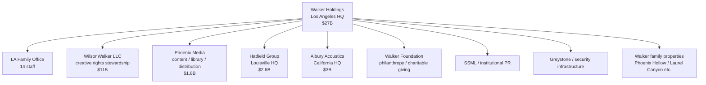

# Walker Holdings Full Detail

Use this file for Walker Holdings as a whole: the LA family office, WilsonWalker, the Walker Foundation, institutional PR/security infrastructure, family properties, and the distinction between Walker Holdings and Alex's AW Holdings.

For the operating pillars, use the dedicated detail files:

- `31_HATFIELD_FULL.md` and `32_HATFIELD_PRODUCTS_AND_VENUES.md` — Hatfield Group
- `45_PHOENIX_MEDIA_FULL.md` — Phoenix Media
- `46_ALBURY_ACOUSTICS_FULL.md` — Albury Acoustics

For Alex's personal entity, use:

- `25_AW_HOLDINGS_FULL.md` — AW Holdings, personal entity mechanics
- `26_SERENA_MANAGEMENT_AND_ALX_BRAND.md` — Serena Management / al.x

## Core Position

Walker Holdings is Rosie Walker's family enterprise and the umbrella structure around the Walker/Wilson family business machine.

| Field | Canon |
|---|---|
| Entity | Walker Holdings LLC |
| Base / HQ | Los Angeles, California |
| CEO | Eleanor Vance |
| Story-open enterprise value | $27B |
| Family office staff | 14 at LA HQ |
| Function | strategic direction, capital allocation, investments, legal, rights, property, security oversight, charitable giving, tax, estate planning |

Do not place Walker Holdings HQ in Louisville. Louisville is Hatfield Group's corporate HQ.

Walker Holdings is not Alex's personal management company. Alex has AW Holdings / Serena Management / al.x for his personal assets, staff, career/commercial readiness, and rights layer.

## Value Architecture

Most of the enterprise value sits in the catalogs and archive at WilsonWalker. The operating pillars deploy the family's cultural authority into real cash-flowing businesses that compound that value.

| Component | Value | Type |
|---|---:|---|
| WilsonWalker LLC | $11B | rights stewardship — catalogs, masters, archive |
| Albury Acoustics | $3B | operating pillar — audio technology |
| Hatfield Group | $2.6B | operating pillar — hospitality, spirits, lifestyle |
| Phoenix Media | $1.8B | operating pillar — content, library, distribution |
| Family office investments | $3.5B | public/private equity, infrastructure, separately managed accounts |
| Property portfolio | $2B | Phoenix Hollow, Laurel Canyon, LA HQ, other family properties |
| Cash & liquidity | $1.5B | operating reserves, capital allocation runway |
| Other | $1.6B | foundation reserves, retained earnings, smaller positions |
| Walker Foundation | not valued in enterprise figure | philanthropic |
| **Walker Holdings total** | **$27B** | |

The catalog/archive foundation is the unmoved engine. Three operating pillars sit on top, each anchored in something authentic to the family but each fully arms-length and culturally distinct: Hatfield is whiskey/hospitality, Phoenix Media is music documentary/cultural storytelling, Albury Acoustics is audio technology.

Each pillar has its own CEO and board. Walker Holdings is majority owner, board oversight, capital allocation, and legal/PR escalation when the family name is involved.

## Top-Level Structure

## Ownership and Governance

| Entity | Stake | Voting |
|---|---:|---|
| Walker family trust structures | 92% | full voting Class A |
| David Homer Wilson | 4% | non-voting Class B |
| AW Holdings / AW Investments (Alex) | 4% | non-voting Class B |
| External | 0% | — |

David's 4% is his original protected allocation and remains his personally while he is alive. AW Holdings holds only Alex's own 4% allocation from his 21st birthday in 2024. Both positions are locked and illiquid; neither David nor Alex can sell, direct, or use the stake for operational control.

### The Governance Interlock

| Direction | Mechanism |
|---|---|
| Walker -> AW | Eleanor Vance chairs AW Holdings board as the Walker governance presence and family-trust adult |
| AW -> Walker | AW holds Alex's 4% non-voting Class B in Walker Holdings; receives annual distributions when declared; no operational reach |

This is reconsolidation architecture: the mechanism by which AW Holdings can be cleanly merged or absorbed back into Walker Holdings when Alex eventually inherits.

## LA Family Office

| Person / Function | Role |
|---|---|
| Eleanor Vance | CEO; final strategic authority; trust-sensitive decisions; chairs AW Holdings board |
| Graham Forsyth | CFO; financial oversight, allocation, reporting, tax planning |
| Diane Prescott | General Counsel; legal risk, rights control, institutional legal coordination |
| Peter Aldridge | Head of Investments; portfolio strategy with external advisors |
| Sarah Langley | analyst; financial analysis/tracking |
| Connie Briggs | office manager; HQ administrative backbone |
| Property Director | Walker property operations, including Phoenix Hollow and Laurel Canyon |
| Security Director | Greystone contract owner; compound/travel/security protocols |
| Events Coordinator | Solstice and major-event operations |
| Rosie & Homer's PA | day-to-day principal care, compound-based rhythm |
| Admin/support | shared operations |

Nadia Hassani began in the Walker/Alex operational world but is now an AW Holdings employee.

## WilsonWalker LLC

WilsonWalker is the private creative rights stewardship entity for Rosie Walker and Homer Wilson's creative/intellectual property legacy.

| Division | Function | Value |
|---|---|---:|
| Walker Publishing | Rosie's songwriting catalog ownership and publishing control | $3.2B |
| Walker Records | Rosie's master recordings ownership | $2.4B |
| Walker Archive | unreleased film/video/photo/audio documentation, especially 1965-1980 | $3.5B |
| Homer Wilson Asset Management / HWAM | production royalties, technology licensing, credit usage approvals | $500M present value |
| WilsonWalker overall | rights stewardship, preservation, strategic control | $11B |

WilsonWalker is stewardship, not active production. It protects, preserves, administers, approves, and plans long-term legacy control.

## Operating Pillars

### Phoenix Media

Phoenix Media is the Walker Holdings content pillar: music/cultural content production, owned library, distribution, audio, and studios infrastructure. It does not produce on Rosie Walker by default.

### Hatfield Group

Hatfield Group is the Walker Holdings hospitality and spirits pillar. It is headquartered in Louisville, Kentucky. It is a real operating group, not a vanity prop.

### Albury Acoustics

Albury Acoustics is the Walker Holdings audio technology pillar. Name lineage: Albury House -> Earl of Albury -> Albury Acoustics. Homer is Founder Emeritus and a board member; he does not run the business.

## Walker Foundation

Walker Foundation is the philanthropic layer. It sits outside the enterprise valuation figure.

## Institutional PR

SSML / institutional PR handles Walker Holdings, Rosie/Homer institutional posture, Solstice media posture, family-business press, charitable PR, and Walker-level privacy protection.

SSML is not Alex's personal publicist. Alex's personal/global PR readiness is The Lede through Serena Management.

## Security

Greystone is the larger Walker Holdings security infrastructure.

| Layer | Function |
|---|---|
| compound security | Phoenix Hollow gate/perimeter and privacy |
| close protection support | surge support for Alex/Rosie/Homer as needed |
| advance work | routes, venues, travel coordination |
| drivers/local providers | vetted drivers and local security |
| threat monitoring | social media, doxxing, fixation, pap intelligence |
| cyber/deepfake monitoring | AI/deepfake/digital-risk identification and takedown coordination |

Alex mostly sees Kevin and the gate. The full machine is deliberately invisible.

## What Alex Sees

Alex does not experience Walker Holdings as a corporate structure. He sees:

- Eleanor when something is trust-critical
- Kevin / gate / invisible security competence
- Phoenix Hollow working smoothly
- Solstice happening without visible machinery
- Hatfield objects/venues as family-business background
- Albury gear in studios without thinking about it
- Phoenix Media as a cultural company in the family weather
- AW Holdings / Serena Management for his own personal/career structure

He will one day inherit Walker Holdings principal status. He still has nothing to do with running it at story open.

## Key Distinctions

| Do not confuse | Correct distinction |
|---|---|
| Walker Holdings HQ vs Hatfield HQ | Walker Holdings is LA-based; Hatfield Group is Louisville-based |
| Walker Holdings vs AW Holdings | Walker is the family enterprise; AW is Alex's lean personal family office |
| Phoenix Media vs WilsonWalker | Phoenix Media actively produces/licences/distributes media; WilsonWalker stewards rights/archive |
| Albury Acoustics vs Phoenix Hollow Studio | Albury is the Walker-owned audio company; Phoenix Hollow Studio is Homer's personal studio |
| Albury House vs Albury Acoustics | Albury House is Alex's Kensington home; Albury Acoustics is Walker's audio company |
| SSML vs The Lede | SSML is institutional/family; The Lede is Alex personal PR readiness |
| Greystone vs Kevin | Greystone is larger infrastructure; Kevin is Alex's CPO |
| Walker Foundation vs WilsonWalker | Foundation is philanthropy; WilsonWalker is rights stewardship |
